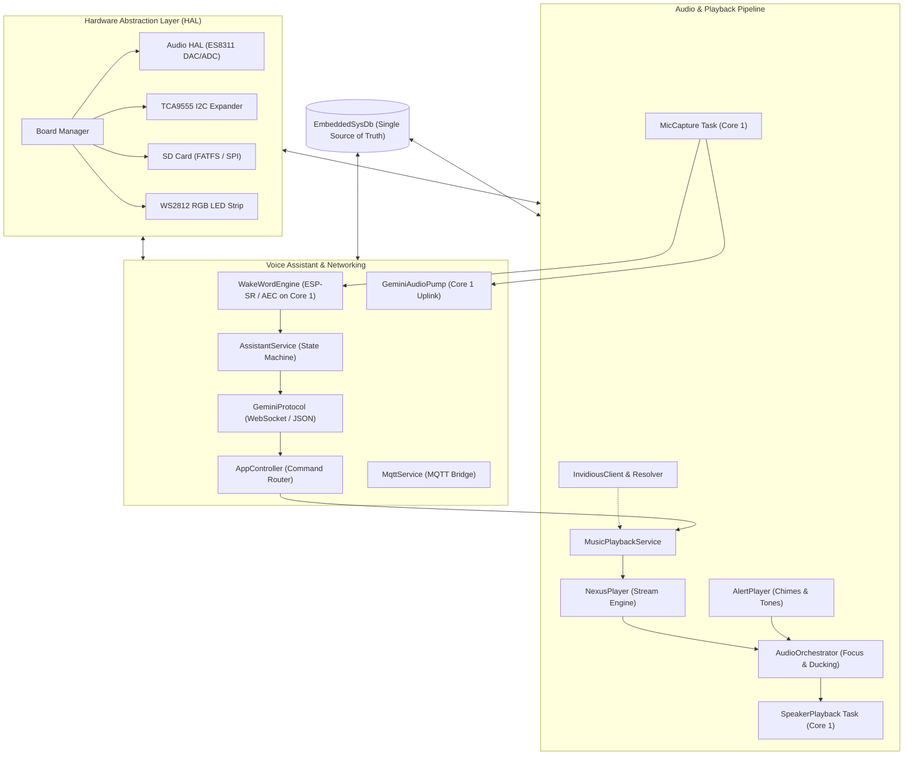

# 🎙️ Waveshare Audio Development Board Firmware

[](https://docs.espressif.com/projects/esp-idf/en/latest/esp32/)
[](https://en.cppreference.com/)
[](https://www.espressif.com/en/products/socs/esp32-s3)
[](LICENSE)

An advanced, production-grade C++17 firmware for the **Waveshare ESP32-S3 Audio Development Board**. This firmware combines an event-driven conversational voice assistant powered by **Google Gemini Live (Bidirectional WebSocket API)**, an intelligent streaming music player powered by **Invidious (NexusPlayer)** with zero-latency autoplay and local SD caching, hands-free **ESP-SR Wake Word detection with Acoustic Echo Cancellation (AEC)**, and a reactive state machine (**EmbeddedSysDb**).

---

## 📖 Table of Contents
1. [System Architecture](#-system-architecture)
2. [Key Highlights](#-key-highlights)
3. [Subsystems Deep Dive](#-subsystems-deep-dive)
   - [Audio Orchestration & Lifecycle](#1-audio-orchestration--lifecycle-audioorchestrator)
   - [NexusPlayer & Invidious Music Engine](#2-nexusplayer--invidious-music-engine)
   - [Gemini Live Voice Assistant & Tool Calling](#3-gemini-live-voice-assistant--tool-calling)
   - [Wake Word Engine & AFE DSP](#4-wake-word-engine--afe-dsp)
   - [EmbeddedSysDb & Reactor Tasks](#5-embeddedsysdb--reactor-tasks)
4. [Repository Structure](#-repository-structure)
5. [Hardware Specifications](#-hardware-specifications)
6. [Getting Started & Configuration](#-getting-started--configuration)
7. [Building & Flashing](#-building--flashing)
8. [Development Guidelines](#-development-guidelines)

---

## 🏗️ System Architecture

The firmware is designed with a strict multi-tier architecture separating hardware abstraction, reactive state management, audio lifecycle orchestration, and application tasks:



---

## 🌟 Key Highlights

* **Proactive Queue Replenishment & 0 ms Gapless Autoplay**: `MusicPlaybackService` monitors playback depth using a low-watermark algorithm (`QUEUE_LOW_WATERMARK = 2`). Upcoming stream URLs and recommended tracks are prefetched in the background into PSRAM stacks (`MALLOC_CAP_SPIRAM`), guaranteeing seamless, zero-latency transitions between songs without stalling the audio clock.
* **Intelligent Audio Orchestration (`AudioOrchestrator`)**: Centralized media lifecycle coordination between Gemini Voice Assistant, NexusPlayer streaming, and AlertPlayer. Automatically pauses/ducks background music when a wake word is detected or the user speaks, and gracefully resumes when the assistant completes its turn.
* **Direct Google Gemini Live Integration**: Bidirectional streaming WebSocket client communicating directly with Google AI Studio (`wss://generativelanguage.googleapis.com`). Zero proxy requirement, dynamic tool/function calling for local and MQTT commands, and real-time linear 3:4 upsampling (24kHz to 32kHz native hardware DAC rate).
* **Hands-free ESP-SR Wake Word & AEC**: Local WakeNet model running on dedicated DSP Core 1 (`CORE_AUDIO`) with real-time Acoustic Echo Cancellation (AEC) and Voice Activity Detection (VAD).
* **EmbeddedSysDb State Pattern**: Zero-allocation, trivially copyable POD system state snapshot with 32-bit component bitmasks. Eliminates busy polling loops via FreeRTOS task notification wakeups (`xTaskNotify`).
* **Persistent SD State & Caching**: Local caching of streaming audio tracks to microSD card (`StorageManager`), automatic state synchronization (`/sdcard/state_sync.txt`), and external JSON configuration loading (`gemini_config.json`, `mqtt_config.json`).

---

## 🧩 Subsystems Deep Dive

### 1. Audio Orchestration & Lifecycle (`AudioOrchestrator`)
The `AudioOrchestrator` replaces monolithic audio managers with an observer-driven priority coordinator:
- **Priority Hierarchy**: Voice Assistant (`GEMINI_SPEAKING`) > Alert Tones (`ALERT`) > Music Playback (`NEXUS_STREAMING`) > Idle.
- **Ducking & Interruption**: When wake-word or Gemini activation occurs while music is playing, `AudioOrchestrator` immediately signals `NexusPlayer::pause()`. Once the assistant transitions to `IDLE`, playback resumes automatically.
- **Resource Management**: Ensures that heavy audio decoders and WebSocket pump buffers yield when higher-priority system alerts execute.

### 2. NexusPlayer & Invidious Music Engine
A streaming media engine engineered specifically for ESP32-S3 constraints:
- **Invidious Client & Instance Resolver**: Queries public or self-hosted Invidious instances (`/api/v1/videos`, `/api/v1/search`) with dynamic fallback handling and JSON response parsing.
- **Modular Decoding (`AudioDecoderFactory`)**: Strategy-based decoding architecture supporting Ogg/Opus (`OggOpusDecoderStrategy`) and WebM/Opus (`WebMOpusDecoder`) using `micro-opus`.
- **PSRAM Task Stacks**: All background prefetch (`bg_prefetch`) and queue replenishment (`bg_replenish`) tasks use `xTaskCreatePinnedToCoreWithCaps` with `MALLOC_CAP_SPIRAM | MALLOC_CAP_8BIT`, eliminating internal SRAM exhaustion.
- **SD Card Stream Caching (`StorageManager`)**: When enabled via SysDb (`cache_downloads`), downloaded audio streams are saved directly to `/sdcard/cache/<videoId>.opus` for immediate offline replay.

### 3. Gemini Live Voice Assistant & Tool Calling
- **Bi-directional WebSocket**: Streams 16-bit PCM audio uplink (16kHz from AFE) and downlink (24kHz from Gemini Live API) in real time.
- **Tool / Function Calling Router**: Converts Gemini JSON function calls into native actions:
  - `play_music(query)` / `next_track` / `pause_music` -> `MusicPlaybackService`
  - `set_volume(level)` -> `AudioHal` / `EmbeddedSysDb`
  - `set_led(color, mode)` -> `LedService`
  - External IoT actions -> `MqttService`
- **Linear Resampler**: Converts incoming 24kHz audio from Gemini into 32kHz native I2S output on-the-fly with fixed-point arithmetic.

### 4. Wake Word Engine & AFE DSP
- **Core Affinity Partitioning**:
  - **Core 0 (`CORE_NETWORK`)**: Network stack, mbedTLS, WebSockets, MQTT, and background HTTP prefetch tasks.
  - **Core 1 (`CORE_AUDIO`)**: I2S DMA, `MicCapture`, `SpeakerPlayback`, `ww_feed`, and `ww_detect`.
  - Isolating AFE feed/detect tasks to Core 1 prevents network/TLS CPU bursts from starving the microphone ring buffer.

### 5. EmbeddedSysDb & Reactor Tasks
- State changes trigger bitmask notifications that wake up only the affected `ReactorTask` instances:
  ```cpp
  // Reactive state mutation example:
  EmbeddedSysDb::getInstance().mutate([](SystemState& s) {
      s.audio.speaker_volume = 90;
      s.audio.autoplay_enabled = true;
  });
  ```
- Subsystems subscribe to specific component bitmasks (`COMP::AUDIO`, `COMP::LED`, `COMP::WIFI`, etc.) without cross-component polling.

---

## 📂 Repository Structure

```
waveshare/
├── main/
│   ├── app/                              # Application Logic & Tasks
│   │   ├── assistant/                    # Assistant state machine & command handlers
│   │   ├── audio/                        # Audio service, orchestrator, capture, & playback
│   │   │   ├── AlertPlayer.h/.cpp        # Chime & tone generator
│   │   │   ├── AudioOrchestrator.h/.cpp  # Focus, ducking, & lifecycle manager
│   │   │   ├── AudioService.h/.cpp       # Audio reactor loop & AFE bridge
│   │   │   ├── MicCapture.h/.cpp         # Microphone I2S DMA reader
│   │   │   └── SpeakerPlayback.h/.cpp    # Speaker I2S DMA writer with jitter control
│   │   ├── gemini_live/                  # WebSocket Gemini Live client & audio pump
│   │   ├── input/                        # KeyService & expander button handling
│   │   ├── led/                          # WS2812 LED strip animations
│   │   ├── media_player/                 # NexusPlayer streaming audio engine
│   │   │   ├── AudioDecoderFactory.h/.cpp# Factory for Opus / WebM decoders
│   │   │   ├── AudioEngine.h/.cpp        # Audio decoding pipeline
│   │   │   ├── HttpClientStream.h/.cpp   # HTTP stream buffer
│   │   │   ├── InvidiousClient.h/.cpp    # Invidious API search & stream resolution
│   │   │   ├── InvidiousInstanceResolver # Dynamic host resolver
│   │   │   ├── MusicPlaybackService.h/.cpp# Queue, prefetch, & autoplay manager
│   │   │   ├── NexusPlayer.h/.cpp        # High-level player interface
│   │   │   ├── OggOpusDecoderStrategy    # Ogg/Opus stream decoder
│   │   │   ├── StorageManager.h/.cpp     # SD card audio file caching
│   │   │   ├── StreamManager.h/.cpp      # HTTP stream lifecycles
│   │   │   └── WebMOpusDecoder.h/.cpp    # WebM container demuxer & decoder
│   │   ├── mqtt/                         # MQTT client for home automation sync
│   │   └── wake_word/                    # ESP-SR WakeNet detection & AFE tasks
│   │
│   ├── common/                           # Cross-cutting Utilities
│   │   ├── sysdb/                        # EmbeddedSysDb state definitions
│   │   ├── AppLogger.h                   # Colorized console logging macros
│   │   ├── ReactorTask.h                 # Reactive thread base class
│   │   └── thread_config.h               # Priorities, core affinities, & stack sizes
│   │
│   ├── hal/                              # Hardware Abstraction Layer
│   │   ├── audio/                        # ES8311 I2S codec driver
│   │   ├── input/                        # TCA9555 keypad driver
│   │   ├── io/                           # I2C bus manager
│   │   ├── led/                          # WS2812 RMT driver
│   │   ├── network/                      # Wi-Fi station connection manager
│   │   ├── storage/                      # SD card SPI / FATFS mounter
│   │   └── Board.cpp                     # Central board hardware initializer
│   │
│   ├── services/                         # Core Infrastructure
│   │   ├── alarm/                        # Alarm clock service
│   │   ├── storage/                      # SD card state sync & persistence
│   │   ├── time/                         # SNTP network clock sync
│   │   └── BufferManager.cpp             # Statically allocated PSRAM ring buffers
│   │
│   ├── CMakeLists.txt                    # Component build definitions
│   ├── Kconfig.projbuild                 # Menuconfig schema
│   └── main.cpp                          # System entry point (app_main)
│
├── components/                           # Managed & external ESP-IDF components
├── scripts/                              # Host testing tools & Invidious utilities
├── sdkconfig                             # Active project configuration
└── CMakeLists.txt                        # Root CMake file
```

---

## ⚡ Hardware Specifications

| Component | Specification |
| :--- | :--- |
| **MCU** | ESP32-S3 (Dual-Core Xtensa LX7, 240 MHz, Wi-Fi 4 + BLE 5) |
| **SRAM / PSRAM** | 512 KB Internal SRAM + 8 MB Octal PSRAM |
| **Audio DAC/ADC** | Everest Semi ES8311 (I2S, low-power mono DAC + ADC) |
| **Microphone** | Dual onboard MEMS microphones with ESP-SR AEC/VAD |
| **Audio Amplifier** | Class-D Speaker Driver connected to ES8311 DAC output |
| **I/O Expander** | TI TCA9555 (16-bit I2C GPIO expander for buttons) |
| **Storage** | MicroSD Card slot connected via SPI / FATFS |
| **Visual Indicator** | WS2812 Addressable RGB LED Strip (RMT driver) |

---

## ⚙️ Getting Started & Configuration

### 1. Hardware Setup
1. Insert a formatted FAT32 MicroSD card into the board's slot.
2. Optional: Place a `gemini_config.json` file in the root of the SD card:
   ```json
   {
       "api_key": "YOUR_GOOGLE_AI_STUDIO_API_KEY",
       "model": "gemini-2.0-flash-exp"
   }
   ```
3. Optional: Place an `mqtt_config.json` file for MQTT broker settings.

### 2. Kconfig Configuration
Run `menuconfig` to adjust Wi-Fi credentials and runtime defaults:
```bash
idf.py menuconfig
```
Navigate to **Waveshare Audio Development Board Config**:
- **Wi-Fi Station Settings**: Set SSID and Password.
- **Voice Assistant Backend**: Select `Standalone Gemini Live Direct Integration` and configure API key.
- **Invidious Configuration**: Set default Invidious API host or local proxy.

---

## 🛠️ Building & Flashing

This project is built using the **ESP-IDF v5.x / v6.x toolchain**.

### Environment Setup
```bash
# Load ESP-IDF environment variables
. /home/ankitm/.espressif/v6.0.1/esp-idf/export.sh

# Activate Python virtual environment
. /home/ankitm/.espressif/tools/python/v6.0.1/venv/bin/activate
```

### Build & Flash
```bash
# Clean build (optional)
idf.py fullclean

# Build firmware
idf.py build

# Flash to device and open serial monitor (replace PORT with e.g. /dev/ttyACM0 or /dev/ttyUSB0)
idf.py -p /dev/ttyACM0 flash monitor
```

---

## 📝 Development Guidelines

1. **PSRAM Task Stack Allocations**:
   Any background task requiring a stack larger than `STACK_NORMAL` (4 KB) must be created using `xTaskCreatePinnedToCoreWithCaps` with `MALLOC_CAP_SPIRAM | MALLOC_CAP_8BIT` to protect internal SRAM from fragmentation.
2. **Core Affinity Discipline**:
   - **Core 0**: Network I/O, mbedTLS handshakes, HTTP streaming, MQTT, SD card file writes.
   - **Core 1**: Real-time audio processing (`SpeakerPlayback`, `MicCapture`, `ww_feed`, `ww_detect`, and `GeminiAudioPump`).
3. **State Mutation**:
   Never modify `SystemState` variables directly. Always wrap mutations in `EmbeddedSysDb::getInstance().mutate([...](SystemState& s) { ... });` to trigger reactor wakeups.
4. **Thread Safety**:
   Use `std::recursive_mutex` or scoped lock guards when modifying queue and playback state across FreeRTOS background tasks. Do not hold locks while making synchronous network calls.
