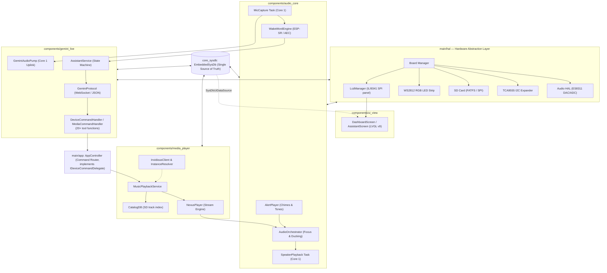
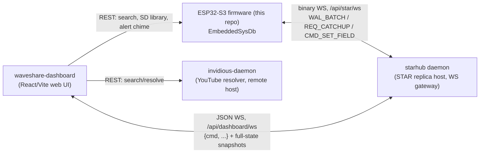

# 🎙️ Waveshare Audio Development Board Firmware

[](https://docs.espressif.com/projects/esp-idf/en/latest/esp32/)
[](https://en.cppreference.com/)
[](https://www.espressif.com/en/products/socs/esp32-s3)
[](LICENSE)

An advanced, production-grade C++17 firmware for the **Waveshare ESP32-S3 Audio Development Board**. This firmware combines an event-driven conversational voice assistant powered by **Google Gemini Live (Bidirectional WebSocket API)** with 20+ voice-driven tool functions, an intelligent streaming music player powered by **Invidious (NexusPlayer)** with zero-latency autoplay and local SD caching, hands-free **ESP-SR Wake Word detection with Acoustic Echo Cancellation (AEC)**, an on-device **LVGL v9 touchscreen dashboard** (ILI9341 + XPT2046), and a reactive state machine (**EmbeddedSysDb**) that also replicates over the network to a host-side control stack (`starhub` + a web dashboard, in [sibling repos](#companion-repositories)).

---

## 📖 Table of Contents
1. [System Architecture](#-system-architecture)
2. [Key Highlights](#-key-highlights)
3. [Subsystems Deep Dive](#-subsystems-deep-dive)
   - [Audio Orchestration & Lifecycle](#1-audio-orchestration--lifecycle-audioorchestrator)
   - [NexusPlayer & Invidious Music Engine](#2-nexusplayer--invidious-music-engine)
   - [Gemini Live Voice Assistant & Tool Calling](#3-gemini-live-voice-assistant--tool-calling)
   - [Wake Word Engine & AFE DSP](#4-wake-word-engine--afe-dsp)
   - [EmbeddedSysDb & Reactor Tasks](#5-embeddedsysdb--reactor-tasks)
   - [On-Device Display & Touch UI](#6-on-device-display--touch-ui)
4. [Repository Structure](#-repository-structure)
5. [Hardware Specifications](#-hardware-specifications)
6. [Getting Started & Configuration](#-getting-started--configuration)
7. [Building & Flashing](#-building--flashing)
8. [Development Guidelines](#-development-guidelines)

---

## 🏗️ System Architecture

The firmware is organized as a thin `main/` app-wiring layer on top of five ESP-IDF **components**, each independently buildable and each with its own README (see [Repository Structure](#-repository-structure)):



### System-of-systems view

This repo is the **firmware side only**. In production the board talks to
a small host-side stack over the STAR wire protocol (a schema-driven state
replication protocol compiled from `schema/sysdb.star`); that stack lives
in sibling repos, not here:



`starhub` and `waveshare-dashboard` run as Docker containers (see
[Companion repositories](#companion-repositories) below) — the firmware
itself is still flashed the normal ESP-IDF way and has no Docker
involvement.

---

## 🌟 Key Highlights

* **Proactive Queue Replenishment & 0 ms Gapless Autoplay**: `MusicPlaybackService` monitors playback depth using a low-watermark algorithm (`QUEUE_LOW_WATERMARK = 2`). Upcoming stream URLs and recommended tracks are prefetched in the background into PSRAM stacks (`MALLOC_CAP_SPIRAM`), guaranteeing seamless, zero-latency transitions between songs without stalling the audio clock.
* **Intelligent Audio Orchestration (`AudioOrchestrator`)**: Centralized media lifecycle coordination between Gemini Voice Assistant, NexusPlayer streaming, and AlertPlayer. Automatically pauses/ducks background music when a wake word is detected or the user speaks, and gracefully resumes when the assistant completes its turn.
* **Direct Google Gemini Live Integration**: Bidirectional streaming WebSocket client communicating directly with Google AI Studio (`wss://generativelanguage.googleapis.com`). Zero proxy requirement, dynamic tool/function calling with 20+ functions spanning music control, device settings (volume/LED), SD file I/O, voice-scheduled alarms, and persistent memory notes — see [Subsystem 3](#3-gemini-live-voice-assistant--tool-calling) for the exact tool list and its one unimplemented function. Real-time linear 3:4 upsampling (24kHz to 32kHz native hardware DAC rate).
* **Hands-free ESP-SR Wake Word & AEC**: Local WakeNet model running on dedicated DSP Core 1 (`CORE_AUDIO`) with real-time Acoustic Echo Cancellation (AEC) and Voice Activity Detection (VAD).
* **On-Device LVGL Touchscreen Dashboard**: A 320×240 ILI9341 SPI display with XPT2046 touch renders a live `DashboardScreen`/`AssistantScreen` (LVGL v9), driven directly off `EmbeddedSysDb` snapshots — no phone/web app required to see device state.
* **EmbeddedSysDb State Pattern**: Zero-allocation, trivially copyable POD system state snapshot with 32-bit component bitmasks. Eliminates busy polling loops via FreeRTOS task notification wakeups (`xTaskNotify`). The same state is WAL-replicated over WebSocket to the host-side `starhub` daemon (see [Companion repositories](#companion-repositories)).
* **Persistent SD State & Caching**: Local caching of streaming audio tracks to microSD card (`StorageManager`), automatic state synchronization (`/sdcard/state_sync.txt`), and external JSON configuration loading (`gemini_config.json`).

---

## 🧩 Subsystems Deep Dive

### 1. Audio Orchestration & Lifecycle (`AudioOrchestrator`)
Lives in `components/audio_core`. The `AudioOrchestrator` replaces monolithic audio managers with an observer-driven priority coordinator:
- **Priority Hierarchy**: Voice Assistant (`GEMINI_SPEAKING`) > Alert Tones (`ALERT`) > Music Playback (`NEXUS_STREAMING`) > Idle.
- **Ducking & Interruption**: When wake-word or Gemini activation occurs while music is playing, `AudioOrchestrator` immediately signals `NexusPlayer::pause()`. Once the assistant transitions to `IDLE`, playback resumes automatically.
- **Resource Management**: Ensures that heavy audio decoders and WebSocket pump buffers yield when higher-priority system alerts execute.

### 2. NexusPlayer & Invidious Music Engine
Lives in `components/media_player`, a streaming media engine engineered specifically for ESP32-S3 constraints:
- **Invidious Client & Instance Resolver**: `InvidiousInstanceResolver` queries a rotating list of public/self-hosted Invidious instances with health checks and automatic failover (`markInstanceFailed()`); a custom instance can be pinned via `setCustomInstance()`. There is no dedicated Kconfig option for this — it's resolved entirely at runtime.
- **Modular Decoding (`AudioDecoderFactory`)**: Strategy-based decoding architecture supporting Ogg/Opus (`OggOpusDecoderStrategy`) and WebM/Opus (`WebMOpusDecoder`) using `micro-opus`.
- **PSRAM Task Stacks**: All background prefetch (`bg_prefetch`) and queue replenishment (`bg_replenish`) tasks use `xTaskCreatePinnedToCoreWithCaps` with `MALLOC_CAP_SPIRAM | MALLOC_CAP_8BIT`, eliminating internal SRAM exhaustion.
- **SD Card Stream Caching (`StorageManager`)**: When enabled via SysDb (`cache_downloads`), downloaded audio streams are saved directly to `/sdcard/cache/<videoId>.opus` for immediate offline replay.
- **Local Library Index (`CatalogDB`)**: Indexes cached SD tracks for offline browsing/search from the web dashboard's SD Library view. (There's also an unbuilt, unreferenced `MusicLibraryManager.cpp`/`.h` in this component that `CatalogDB` appears to supersede — see `components/media_player/README.md`.)

### 3. Gemini Live Voice Assistant & Tool Calling
Lives in `components/gemini_live`:
- **Bi-directional WebSocket**: Streams 16-bit PCM audio uplink (16kHz from AFE) and downlink (24kHz from Gemini Live API) in real time, to model `gemini-3.1-flash-live-preview`.
- **Tool / Function Calling Router** (`DeviceCommandHandler` + `MediaCommandHandler`, dispatched via `IDeviceCommandDelegate` -> `AppController`): the live tool surface, generated from `components/gemini_live/schema/gemini_skills_schema.json`, currently has these functions —
  - Media: `play(query)`, `play_next(query)`, `pause`, `resume`, `stop`, `next`, `previous`, `volume(level)`, `mute`, `autoplay(enabled)`, `set_caching(enabled)`
  - Device: `set_device_volume(level)`, `set_led_strip(r,g,b)`, `restart_websocket_client`
  - Storage/memory: `read_file(path)`, `write_file(path, content)`, `save_to_memory(text)`
  - Alarms: `set_alarm(hour, minute, tone_file?, enabled?)`, `stop_active_alarm` — both real, backed by `Services::AlarmService`
  - **`mqtt_forward(topic, message)` is defined but not implemented**: `AppController::publishMqtt()` is a permanent stub that always returns `false`. MQTT has a Kconfig section (`WAVESHARE_MQTT_*`) and a reserved SysDb component slot, but no `MqttService` class or `esp_mqtt` client exists in this codebase — treat any MQTT references elsewhere in this doc set as aspirational, not shipped.
- **Linear Resampler**: Converts incoming 24kHz audio from Gemini into 32kHz native I2S output on-the-fly with fixed-point arithmetic.

### 4. Wake Word Engine & AFE DSP
`WakeWordEngine` lives in `components/audio_core` (not a separate `wake_word/` module):
- **Core Affinity Partitioning**:
  - **Core 0 (`CORE_NETWORK`)**: Network stack, mbedTLS, WebSockets, and background HTTP prefetch tasks.
  - **Core 1 (`CORE_AUDIO`)**: I2S DMA, `MicCapture`, `SpeakerPlayback`, `ww_feed`, and `ww_detect`.
  - Isolating AFE feed/detect tasks to Core 1 prevents network/TLS CPU bursts from starving the microphone ring buffer.
- Gated by `CONFIG_WAVESHARE_WAKEWORD_ENABLE` (Kconfig); disabled by default.

### 5. EmbeddedSysDb & Reactor Tasks
Lives in `components/core_sysdb` (not `main/common/sysdb` — that path doesn't exist). State changes trigger bitmask notifications that wake up only the affected `ReactorTask` instances:
  ```cpp
  // Reactive state mutation example:
  EmbeddedSysDb::getInstance().mutate([](SystemState& s) {
      s.audio.speaker_volume = 90;
      s.audio.autoplay_enabled = true;
  });
  ```
- Subsystems subscribe to specific component bitmasks (`COMP::AUDIO`, `COMP::LED`, `COMP::WIFI`, etc.) without cross-component polling. The schema (`schema/sysdb.star`) currently defines 9 components: `System`, `Audio`, `Pipeline`, `Assistant`, `Led`, `Mqtt`, `Alarm`, `Bluetooth`, `Media`. `Mqtt`'s fields exist in the schema but, per above, have no live writer.
- `SysDbSyncReactor` (`main/services/storage`) persists relevant state to `/sdcard/state_sync.txt`; `StarWsClient` (`main/services/network`) WAL-replicates it over WebSocket to `starhub` at `ws://<server_ip>:8765/api/star/ws`.

### 6. On-Device Display & Touch UI
Lives in `components/ui_view` + `main/hal/display`:
- **Hardware**: 320×240 ILI9341 SPI TFT (`LcdManager`) with an XPT2046 resistive touch controller on the same SPI bus, both gated by Kconfig (`CONFIG_DISPLAY_ENABLE`, default on; `CONFIG_TOUCH_ENABLE`, default on).
- **Rendering**: LVGL v9 (`lvgl/lvgl` + `espressif/esp_lvgl_port`, declared in `components/ui_view/idf_component.yml`), with `DashboardScreen` and `AssistantScreen` views.
- **Data source**: `SysDbUiDataSource` reads live `EmbeddedSysDb` snapshots into a `UiSnapshot` for the screens to render — this is the same state the web dashboard sees, just rendered locally with no network dependency.
- **Known placeholders**: `PlaceholderData.h` documents a handful of fields with no real backing data yet (ambient weather condition/temp text, assistant model/voice display strings, LED-color read-back, a sample assistant transcript) — each entry there explains what a real data source would need to wire up.

---

## 📂 Repository Structure

```
waveshare/
├── main/
│   ├── app/                              # Thin app-level wiring (most logic now lives in components/)
│   │   ├── AppController.h/.cpp          # Central command router; implements IDeviceCommandDelegate
│   │   ├── audio/
│   │   │   ├── AudioService.h/.cpp       # Audio reactor loop & AFE bridge
│   │   │   └── recording/                # AudioRecorder, WavPcmEncoder (voice-note capture)
│   │   ├── input/                        # KeyService (expander button handling)
│   │   └── led/                          # LedService (WS2812 strip control)
│   │
│   ├── common/                           # hw_types.h only — see components/core_sysdb for shared utilities
│   │
│   ├── hal/                              # Hardware Abstraction Layer
│   │   ├── audio/                        # ES8311 I2S codec driver (AudioHal)
│   │   ├── display/                      # LcdManager — ILI9341 SPI panel init
│   │   ├── input/                        # TCA9555 expander key input driver
│   │   ├── io/                           # I2C bus manager, IoExpander
│   │   ├── led/                          # WS2812 RMT driver (LedStripManager)
│   │   ├── network/                      # WifiService (station connection)
│   │   ├── storage/                      # SD card SPI / FATFS mounter
│   │   └── Board.cpp                     # Central board hardware initializer
│   │
│   ├── services/                         # Higher-level app services
│   │   ├── alarm/                        # AlarmService — voice-scheduled alarms (real, wired)
│   │   ├── network/                      # WifiService, StarWsClient (STAR uplink to starhub),
│   │   │                                 # HttpFileServerService (web config UI), CaptiveDnsServer
│   │   ├── storage/                      # StorageService, SysDbSyncReactor (state -> SD persistence)
│   │   └── time/                         # TimeSyncHelper (SNTP)
│   │
│   ├── CMakeLists.txt                    # Component build definitions
│   ├── Kconfig.projbuild                 # Menuconfig schema
│   └── main.cpp                          # System entry point (app_main)
│
├── components/                           # ESP-IDF components — each has its own README.md
│   ├── core_sysdb/                       # EmbeddedSysDb, WAL replication, generated SystemState schema
│   ├── audio_core/                       # AudioOrchestrator, SpeakerPlayback, MicCapture, AlertPlayer,
│   │                                     # WakeWordEngine, Resampler
│   ├── media_player/                     # NexusPlayer, InvidiousClient, decoders, StorageManager,
│   │                                     # CatalogDB (SD track index)
│   ├── gemini_live/                      # Gemini Live WS client, tool-calling router, AssistantService
│   ├── ui_view/                          # LVGL v9 touchscreen dashboard (DashboardScreen, AssistantScreen)
│   └── espressif__led_strip/             # Managed upstream WS2812 driver (has its own upstream README)
│
├── schema/sysdb.star                     # STAR schema — source of truth for SystemState fields
├── tools/
│   ├── starc/                            # Schema compiler: sysdb.star -> SystemState.generated.h
│   └── lvgl_sim/                         # Desktop LVGL UI emulator for ui_view development
├── host_tests/                           # Host-side (non-ESP32) unit tests
├── docs/
├── sdkconfig                             # Active project configuration
└── CMakeLists.txt                        # Root CMake file
```

### Companion repositories

The host-side services that used to live under `server/` and `web-app/`
in this repo now live in their own repositories, each pulling in a
vendored copy of the STAR wire-protocol headers generated here from
`schema/sysdb.star`:

- [`starhub`](https://github.com/AnkitVats21/starhub) — the STAR replica
  daemon that syncs firmware system state over a binary WebSocket
  protocol (formerly `server/star-replica-daemon`).
- [`waveshare-dashboard`](https://github.com/AnkitVats21/waveshare-dashboard) —
  the React/Vite web dashboard (formerly `web-app/`).
- [`invidious-daemon`](https://github.com/AnkitVats21/invidious-daemon) —
  the Invidious-backed YouTube audio resolver/cache daemon (formerly
  `server/invidious-daemon`), deployed separately and not part of the
  local Docker stack below.

**Schema changes propagate manually.** When `schema/sysdb.star` changes,
regenerate `SystemState.generated.h` here via `tools/starc`, then copy the
updated headers into `starhub`'s `vendor/core_sysdb/` — there's no
automated sync between the two repos yet.

**Running `starhub` + `waveshare-dashboard` locally** is done via Docker
Compose from the sibling `~/ai-assistant` directory (one level up from
this repo), not as bare background processes — a stale bare daemon binary
silently drifting out of sync with the dashboard's expected snapshot shape
has caused real bugs before:

```bash
cd ~/ai-assistant
docker compose up -d --build
```

This starts `starhub` on `:8765` (WS + REST) and the dashboard on `:5173`.
See `~/ai-assistant/AGENT.md` for the full system layout.

---

## ⚡ Hardware Specifications

| Component | Specification |
| :--- | :--- |
| **MCU** | ESP32-S3 (Dual-Core Xtensa LX7, 240 MHz, Wi-Fi 4 + BLE 5) |
| **SRAM / PSRAM** | 512 KB Internal SRAM + 8 MB Octal PSRAM |
| **Audio DAC/ADC** | Everest Semi ES8311 (I2S, low-power mono DAC + ADC) |
| **Microphone** | Dual onboard MEMS microphones with ESP-SR AEC/VAD |
| **Audio Amplifier** | Class-D Speaker Driver connected to ES8311 DAC output |
| **I/O Expander** | TI TCA9555 (16-bit I2C GPIO expander for buttons) |
| **Storage** | MicroSD Card slot connected via SPI / FATFS |
| **Visual Indicator** | WS2812 Addressable RGB LED Strip (RMT driver) |
| **Display** | 320×240 ILI9341 SPI TFT, LVGL v9 UI (`CONFIG_DISPLAY_ENABLE`, on by default) |
| **Touch** | XPT2046 resistive touch controller, same SPI bus (`CONFIG_TOUCH_ENABLE`, on by default) |

---

## ⚙️ Getting Started & Configuration

### 1. Hardware Setup
1. Insert a formatted FAT32 MicroSD card into the board's slot.
2. Optional: Place a `gemini_config.json` file in the root of the SD card to supply the API key without rebuilding firmware (only `api_key` is read — the Gemini model is fixed in code, not configurable via this file):
   ```json
   {
       "api_key": "YOUR_GOOGLE_AI_STUDIO_API_KEY"
   }
   ```
   Falls back to the `GEMINI_API_KEY` Kconfig value if this file is absent.

### 2. Kconfig Configuration
Run `menuconfig` to adjust Wi-Fi credentials and runtime defaults:
```bash
idf.py menuconfig
```
Navigate to **Waveshare Audio Development Board Config**:
- **Wi-Fi Station Settings**: Set SSID and Password.
- **Voice Assistant Backend Configuration**: Set `GEMINI_API_KEY`. The `Active Voice Backend` choice also lists a `Legacy RTP Streamer/Receiver Proxy` option (and defaults to it), but that backend has no implementation left in this codebase — Gemini Live is compiled in unconditionally regardless of this choice, so the choice itself is currently vestigial. Don't rely on it to switch anything.
- **Invidious host**: there's no Kconfig option for this — `InvidiousInstanceResolver` (in `components/media_player`) resolves a working public instance automatically at runtime, with failover. Call `InvidiousInstanceResolver::setCustomInstance()` in code if you need to pin one.
- **Waveshare SPI Display and Touch Configuration**: `DISPLAY_ENABLE`/`TOUCH_ENABLE` and their pin assignments, if your wiring differs from the board defaults.

---

## 🛠️ Building & Flashing

This project is built using the **ESP-IDF v5.x / v6.x toolchain**.

### Environment Setup
```bash
# Load ESP-IDF environment variables
. /home/ankitm/.espressif/v6.0.1/esp-idf/export.sh

# Activate Python virtual environment
. /home/ankitm/.espressif/tools/python/v6.0.1/venv/bin/activate
```

### Build & Flash
```bash
# Clean build (optional)
idf.py fullclean

# Build firmware
idf.py build

# Flash to device and open serial monitor (replace PORT with e.g. /dev/ttyACM0 or /dev/ttyUSB0)
idf.py -p /dev/ttyACM0 flash monitor
```

---

## 📝 Development Guidelines

1. **PSRAM Task Stack Allocations**:
   Any background task requiring a stack larger than `STACK_NORMAL` (4 KB) must be created using `xTaskCreatePinnedToCoreWithCaps` with `MALLOC_CAP_SPIRAM | MALLOC_CAP_8BIT` to protect internal SRAM from fragmentation.
2. **Core Affinity Discipline**:
   - **Core 0**: Network I/O, mbedTLS handshakes, HTTP streaming, SD card file writes.
   - **Core 1**: Real-time audio processing (`SpeakerPlayback`, `MicCapture`, `ww_feed`, `ww_detect`, and `GeminiAudioPump`).
3. **State Mutation**:
   Never modify `SystemState` variables directly. Always wrap mutations in `EmbeddedSysDb::getInstance().mutate([...](SystemState& s) { ... });` to trigger reactor wakeups.
4. **Thread Safety**:
   Use `std::recursive_mutex` or scoped lock guards when modifying queue and playback state across FreeRTOS background tasks. Do not hold locks while making synchronous network calls.
