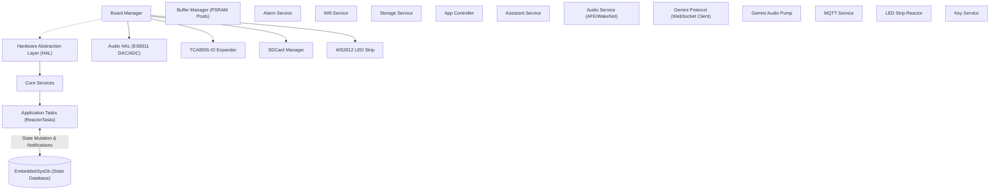

# 🎙️ Waveshare Audio Development Board Firmware

[](https://docs.espressif.com/projects/esp-idf/en/latest/esp32/)
[](https://en.cppreference.com/)
[](https://www.espressif.com/en/products/socs/esp32-s3)
[](LICENSE)

An advanced C++ firmware project for the **Waveshare Audio Development Board (ESP32-S3)**. This firmware integrates a highly modular, event-driven voice-assistant client supporting hands-free wake word detection, real-time audio streaming (RTP), dynamic audio sample rate switching, and direct WebSocket-based streaming connection to Google's **Gemini Live API** with full tool/function calling support.

---

## 📖 Table of Contents
1. [System Architecture](#-system-architecture)
2. [Key Features](#-key-features)
3. [Repository Structure](#-repository-structure)
4. [State Management (EmbeddedSysDb)](#-state-management-embeddedsysdb)
5. [Audio Pipeline & Playback](#-audio-pipeline--playback)
6. [Gemini Live Protocol Integration](#-gemini-live-protocol-integration)
7. [Getting Started & Configuration](#-getting-started--configuration)
8. [Building & Flashing](#-building--flashing)
9. [Development Conventions](#-development-conventions)

---

## 🏗️ System Architecture

The firmware utilizes a strict layered architecture to decouple hardware, state management, background services, and application control logic:



---

## 🌟 Key Features

*   **Dual Voice Backends**:
    *   **Direct Gemini Live**: Direct, secure WebSockets (`wss://`) stream to Google AI Studio with zero proxy overhead.
    *   **Legacy RTP Proxy**: Stream raw PCM audio via UDP to a local Go/Python media relay server.
*   **Local Wake Word Engine**: Implemented via Espressif's ESP-SR (WakeNet) supporting local hands-free activation (default: *"Hi Esp"*).
*   **EmbeddedSysDb State Management**: A reactive, single-source-of-truth state machine waking up tasks instantly using FreeRTOS notifications (no busy loops).
*   **Robust Audio Pipeline**:
    *   Leaky bucket playback execution at 5ms intervals keeping I2S DMA clocks stable.
    *   Dynamic sample rate switching (16kHz / 24kHz / 32kHz) according to DAC/ADC demands.
    *   On-the-fly 3:4 upsampling (24kHz assistant audio to 32kHz native hardware playback).
    *   On-the-fly 3:2 and 2:1 downsampling (to feed 16kHz audio to WakeWord/AFE engine).
*   **Gemini Tool Calling**: Converts Gemini-generated tool requests (function calls) into local actions (alarms, volume changes) or publishes them to MQTT to control external devices (like an MPV media player).
*   **Persistent Configuration**: SD-card state sync engine updates `/sdcard/state_sync.txt` automatically on change and reloads settings upon boot.

---

## 📂 Repository Structure

```
waveshare/
├── main/
│   ├── app/                      # Application Logic & Tasks
│   │   ├── assistant/            # Assistant state machine & Command handlers (Local / MPV)
│   │   ├── audio/                # Audio task, Alert Player, and RTP receiver
│   │   ├── gemini_live/          # WebSocket client & base64/JSON protocol handling
│   │   ├── input/                # User input processing
│   │   ├── led/                  # LED animations based on system state
│   │   ├── mqtt/                 # MQTT client for status/configuration sync
│   │   └── wake_word/            # Local WakeNet model & VAD detection
│   │
│   ├── common/                   # Shared Utilities & Structures
│   │   ├── sysdb/                # EmbeddedSysDb state definitions
│   │   ├── AppLogger.h           # Unified console logging macros
│   │   ├── ReactorTask.h         # EmbeddedSysDb-reactive task base class
│   │   ├── TaskBase.h            # Basic FreeRTOS wrapper class
│   │   └── thread_config.h       # Task priorities and PSRAM stack sizes
│   │
│   ├── hal/                      # Hardware Abstraction Layer
│   │   ├── audio/                # ES8311 DAC and I2S configuration
│   │   ├── input/                # ExpanderKeyInput driver
│   │   ├── io/                   # I2C Bus and TCA9555 IO expander drivers
│   │   ├── led/                  # WS2812 RGB LED controller
│   │   ├── network/              # WiFi hardware management
│   │   ├── storage/              # SD Card mount and read/write drivers
│   │   └── Board.cpp             # Central hardware initiator
│   │
│   ├── services/                 # Infrastructure Services
│   │   ├── alarm/                # Alarm triggers and WAV playbacks
│   │   ├── config_manager/       # Kconfig and JSON schema managers
│   │   ├── storage/              # Storage abstraction layer
│   │   ├── time/                 # SNTP synchronization task
│   │   └── BufferManager.cpp     # Pre-allocated ring buffers in PSRAM
│   │
│   ├── CMakeLists.txt            # Main component build instructions
│   ├── Kconfig.projbuild         # Kconfig configuration menus
│   └── main.cpp                  # Firmware entrypoint (app_main)
│
├── components/                   # External components (led_strip, etc.)
├── scripts/                      # PC-side utilities (RTP testers, streams, makefiles)
├── sdkconfig                     # Local project configuration (gitignored)
└── CMakeLists.txt                # Root project build instructions
```

---

## ⚡ State Management (EmbeddedSysDb)

The project handles inter-thread communication and synchronization through a lightweight state-reactor pattern called **EmbeddedSysDb**:

*   **Trivially Copyable Snapshot**: System state is declared in a flat Plain Old Data (POD) structure (`SystemState`). This permits lock-free, zero-allocation snap-taking.
*   **Hierarchical Masking**: State changes use a 32-bit `ComponentMask`. The upper 16 bits filter by subsystem categories (e.g. `COMP::AUDIO`, `COMP::WIFI`), while the lower 16 bits target detailed fields (e.g. `BIT_AUDIO::SPEAKER_VOLUME`).
*   **Zero-Latency ReactorTask Wakeups**: Tasks inherit from `ReactorTask`. State mutations wake up appropriate threads instantly and synchronously via FreeRTOS task notification bits (`xTaskNotify`), completely eliminating polling loops.

```cpp
// Example: Mutating the volume state
EmbeddedSysDb::getInstance().mutate([](SystemState& s) {
    s.audio.speaker_volume = 85;
});
// (EmbeddedSysDb automatically alerts any task registered to COMP::AUDIO via task notifications)
```

---

## 🎵 Audio Pipeline & Playback

The audio pipeline utilizes a **Leaky Bucket Playback** method to optimize audio latency and maintain stability under fluctuating network conditions:

*   **DMA Clock Continuity**: Rather than waiting for a buffer threshold and switching the I2S clock on and off, `SpeakerPlayback` runs continuously at a fixed rate (every 5ms / 120 samples at 24kHz) using `vTaskDelayUntil()`. It drains the ring buffer (`SPK_RX_BUF`) directly and writes silent frames when dry to preserve DMA clock integrity.
*   **AFE Downsampling**: The board records audio at 32kHz or 48kHz. Since the local Wake Word engine (WakeNet) and VAD run at 16kHz, a real-time downsampler extracts 16kHz audio frames to feed the ESP-SR algorithms.
*   **Gemini Upsampling**: The Gemini Live assistant streams audio at 24kHz. The speaker hardware operates at 32kHz native. A real-time 3:4 linear upsampler converts the 24kHz incoming stream to 32kHz on-the-fly, preventing hardware clock switches and clicking noises.

---

## 🤖 Gemini Live Protocol Integration

The direct WebSocket-based Gemini Live connection in `GeminiProtocol` is engineered for high performance on embedded chips:

*   **Zero-Allocation Buffers**: Memory blocks for Base64 decoding, WebSocket payloads, and resampling workspace are allocated statically in PSRAM (`MALLOC_CAP_SPIRAM`) during boot, eliminating heap fragmentation risks.
*   **Single-Pass Base64 Decoder**: Decodes Base64 payloads directly into the pre-allocated PSRAM scratchpad to reduce CPU usage.
*   **Tool Calling Flow**:
    ```
    Gemini Live (JSON) ──> GeminiProtocol ──> AppController ──> DeviceCommandHandler (Local Action)
                                                                 └──> MpvCommandHandler (MQTT topic: mpv/command)
    ```

---

## ⚙️ Getting Started & Configuration

All options are configurable using the standard ESP-IDF Kconfig menu:

```bash
idf.py menuconfig
```

### Key Configuration Menus
Under **Waveshare Audio Development Board Config**:
*   **Board Pin Defaults**: Define I2S (MCLK, BCLK, LRCK, DOUT, DIN), I2C, and SD Card GPIO pins.
*   **Wi-Fi Station Settings**: Configure Wi-Fi SSID, Password, and target Audio Relay Server IP.
*   **MQTT Runtime Configuration**: Set up your broker URI (TLS/TLS-less), username, password, and last will topics.
*   **Voice Assistant Backend**: Choose between `Legacy RTP Streamer/Receiver Proxy` or `Standalone Gemini Live Direct Integration`. Enter your Google AI Studio API Key under `Gemini API Key`.

---

## 🛠️ Building & Flashing

This project utilizes the **ESP-IDF Build System** (v5.0+ recommended).

### Environment Setup
If using VS Code, a pre-configured `.devcontainer` configuration is available to pull the correct ESP-IDF Docker container automatically. 

Alternatively, load the environment manually:
```bash
# Load esp-idf environment (if installed locally)
. $IDF_PATH/export.sh
```

### Build and Flash Commands
```bash
# 1. Configure the project
idf.py menuconfig

# 2. Build the firmware
idf.py build

# 3. Flash to ESP32-S3 and open serial monitor
idf.py -p <PORT> flash monitor
```

---

## 📝 Development Conventions

To keep the codebase clean, stable, and readable, adhere to the following rules:

1.  **Memory Management**:
    *   Never perform dynamic allocations (`malloc`, `new`, `std::vector`) inside the real-time audio pipeline or high-frequency loops. Use statically pre-allocated PSRAM buffers.
    *   Avoid deep stacks in tasks. Adjust stack sizes within `main/common/thread_config.h`.
2.  **State Modifications**:
    *   Always modify system state inside the `mutate()` lambda block of `EmbeddedSysDb` to ensure mutations trigger event bitmasks and wake up reactor threads correctly.
3.  **Logging**:
    *   Use `LOGI_SYSTEM`, `LOGW_SYSTEM`, `LOGE_SYSTEM` (or component specific log macros) defined in `AppLogger.h` for clean and formatted console output.
