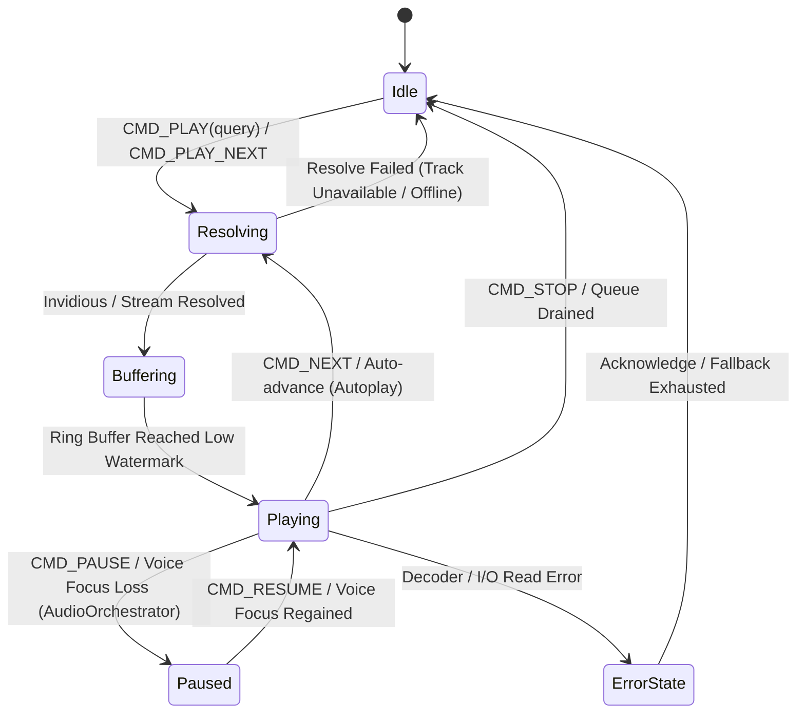
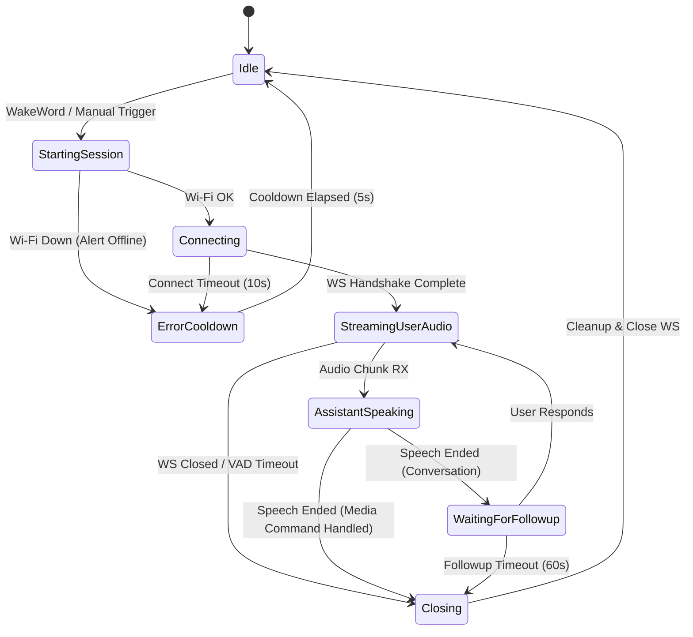

# State Machine Architecture & EmbeddedSysDb Refactoring Plan (Phase 1)

**Target Worktree**: `/home/ankitm/ai-assistant/waveshare-statemachine`  
**Active Branch**: `statemachine-sysdb-refactor`  
**ESP-IDF Environment**: ESP-IDF v6.0.1 (`. /home/ankitm/.espressif/v6.0.1/esp-idf/export.sh >/dev/null 2>&1 && idf.py build`)  

---

## 1. Executive Summary & Goals

Phase 1 establishes a bulletproof, resilient concurrency and state architecture within the current monolithic codebase before modular component extraction (Phase 2) and Python test harness integration (Phase 3).

### Key Architectural Fixes in Phase 1:
1. **First-Class Media State Machine (`COMP::MEDIA`)**:
   Integrate the media playback subsystem into `EmbeddedSysDb`. Relocate playback settings (`autoplay_enabled`, `cache_downloads`) out of `AUDIO_FIELDS` to prevent spurious audio hardware reconfigurations.
2. **True Lockless Audio Mixer Hot Path**:
   Replace the semaphore-locked full-struct `snapshot()` copy in `SpeakerPlaybackTask::run()` with a single 32-bit atomic load (`std::atomic<uint32_t> m_hot_audio_flags`), completely eliminating counting semaphore acquisition overhead and writer-lock starvation in the 10ms audio DMA loop.
3. **Persistent Media Command Queue & Zero Dynamic Task Churn**:
   Eliminate all ephemeral FreeRTOS task spawning (`xTaskCreatePinnedToCoreWithCaps` + `vTaskDelete`) across `MediaCommandHandler`, `KeyService`, `MqttService`, and crucially `MusicPlaybackService` (`bg_prefetch` and `bg_replenish`). Provide priority execution for immediate playback controls (`PAUSE`, `STOP`, `RESUME`) to prevent FIFO head-of-line blocking behind blocking network queries.
4. **Unified Assistant State Machine & Reactor Bitmask Hardening**:
   Consolidate `transitionTo()` and `handleStateTransition()` into a single `executeTransition()` method with unified timer semantics (standardizing the 60s followup timeout). Enforce two-level bitmask gating across all reactors (`(changed & COMP::X) && (changed & BIT_X::FIELD)`) to prevent false-positive triggers from overlapping bit positions (e.g. in `AudioService` and `MqttService`).
5. **Deduplicated Audio Focus & Asynchronous Track Completion**:
   Unify focus pause/resume between `AudioOrchestrator` and `NexusPlayer`, and decouple `NexusPlayer::checkPlaybackFinished()` from synchronous Invidious track resolution.

---

## 2. Component State Machine Models

### A. Media State Machine (`MusicPlaybackService` + `NexusPlayer`)


### B. Assistant State Machine (`AssistantService`)


---

## 3. Step-by-Step Implementation Blueprint

### Step 1: Extend `SystemState.h` & `EmbeddedSysDb`

**Files to modify**:
- `main/common/sysdb/SystemState.h`
- `main/common/sysdb/EmbeddedSysDb.h`
- `main/common/sysdb/EmbeddedSysDb.cpp`

**Changes**:
1. In `SystemState.h`:
   - Add `COMP::MEDIA = (1u << 24);`
   - Define `BIT_MEDIA` namespace:
     ```cpp
     namespace BIT_MEDIA {
         static constexpr ComponentMask STATE    = (1u << 0);
         static constexpr ComponentMask TRACK    = (1u << 1);
         static constexpr ComponentMask REPEAT   = (1u << 2);
         static constexpr ComponentMask DUCKED   = (1u << 3);
         static constexpr ComponentMask AUTOPLAY = (1u << 4);
         static constexpr ComponentMask CACHE    = (1u << 5);
     }
     ```
   - Define enum `MediaPlaybackState`:
     ```cpp
     enum class MediaPlaybackState : uint8_t {
         IDLE,
         RESOLVING,
         BUFFERING,
         PLAYING,
         PAUSED,
         ERROR_STATE
     };
     ```
   - Move `autoplay_enabled` and `cache_downloads` from `AUDIO_FIELDS` into `MEDIA_FIELDS`:
     ```cpp
     #define MEDIA_FIELDS \
         X(MediaPlaybackState, state, MediaPlaybackState::IDLE, BIT_MEDIA::STATE) \
         X_STR(active_song_id, 64, "", BIT_MEDIA::TRACK) \
         X_STR(title, 64, "", BIT_MEDIA::TRACK) \
         X_STR(artist, 64, "", BIT_MEDIA::TRACK) \
         X(uint8_t, repeat_mode, 0, BIT_MEDIA::REPEAT) \
         X(bool, is_ducked, false, BIT_MEDIA::DUCKED) \
         X(bool, autoplay_enabled, true, BIT_MEDIA::AUTOPLAY) \
         X(bool, cache_downloads, false, BIT_MEDIA::CACHE)
     ```
   - Add `struct { MEDIA_FIELDS } media;` inside `SystemState`.

2. In `EmbeddedSysDb.h` & `EmbeddedSysDb.cpp`:
   - Add diff block for `MEDIA_FIELDS` in `EmbeddedSysDb::diffState()`.
   - Add true lockless atomic audio flags cache:
     ```cpp
     // In EmbeddedSysDb.h:
     namespace HotAudioBit {
         static constexpr uint32_t ASST_SPEAKING      = (1u << 0);
         static constexpr uint32_t TURN_COMPLETE_PEND = (1u << 1);
         static constexpr uint32_t COMPANION_CONN     = (1u << 2);
         static constexpr uint32_t COMPANION_SETTLED  = (1u << 3);
     }
     ```
   - Declare `std::atomic<uint32_t> m_hot_audio_flags{0};` in `EmbeddedSysDb`.
   - In `EmbeddedSysDb::mutate()`: update `m_hot_audio_flags` under the write lock:
     ```cpp
     uint32_t hot = 0;
     if (m_state.audio.assistant_speaking)     hot |= HotAudioBit::ASST_SPEAKING;
     if (m_state.audio.turn_complete_pending)  hot |= HotAudioBit::TURN_COMPLETE_PEND;
     if (m_state.bt_companion.connected)       hot |= HotAudioBit::COMPANION_CONN;
     if (m_state.bt_companion.link_settled)    hot |= HotAudioBit::COMPANION_SETTLED;
     m_hot_audio_flags.store(hot, std::memory_order_release);
     ```
   - Expose inline non-blocking readers:
     ```cpp
     inline uint32_t hotAudioFlags() const {
         return m_hot_audio_flags.load(std::memory_order_acquire);
     }
     inline bool hotAssistantSpeaking() const {
         return (hotAudioFlags() & HotAudioBit::ASST_SPEAKING) != 0;
     }
     inline bool hotTurnCompletePending() const {
         return (hotAudioFlags() & HotAudioBit::TURN_COMPLETE_PEND) != 0;
     }
     inline bool hotCompanionConnected() const {
         return (hotAudioFlags() & HotAudioBit::COMPANION_CONN) != 0;
     }
     inline bool hotCompanionSettled() const {
         return (hotAudioFlags() & HotAudioBit::COMPANION_SETTLED) != 0;
     }
     ```

---

### Step 2: Real-Time Audio Mixer Lock Contention Fix

**File to modify**:
- `main/app/audio/SpeakerPlayback.cpp`

**Changes**:
1. Remove `auto snap = EmbeddedSysDb::getInstance().snapshot();` from the 10ms loop in `SpeakerPlaybackTask::run()`.
2. Replace with single atomic load:
   ```cpp
   auto& sysdb = EmbeddedSysDb::getInstance();
   const uint32_t audio_flags = sysdb.hotAudioFlags();
   const bool asst_speaking   = (audio_flags & HotAudioBit::ASST_SPEAKING) != 0;
   const bool turn_pending    = (audio_flags & HotAudioBit::TURN_COMPLETE_PEND) != 0;
   const bool companion_conn  = (audio_flags & HotAudioBit::COMPANION_CONN) != 0;
   const bool companion_set   = (audio_flags & HotAudioBit::COMPANION_SETTLED) != 0;
   const bool companion_active = companion_conn || !companion_set;
   ```
3. In turn completion finalization:
   ```cpp
   if (sustained_empty >= TURN_COMPLETE_DRAIN_TICKS) {
       if (turn_pending) {
           LOGI_HAL("SpeakerPlayback: sustained empty after turn_complete — finalising.");
           sysdb.mutate([](SystemState &s) {
               s.audio.turn_complete_pending = false;
               s.audio.assistant_speaking    = false;
           });
           AudioOrchestrator::getInstance().notifyVoiceEnded();
           sustained_empty = 0;
           m_buffering = true;
       }
   }
   ```
   *Impact*: Zero semaphore acquisitions in the real-time audio loop. Audio DMA cannot be starved by writer transactions.

---

### Step 3: Persistent Media Command Worker Queue & Complete Task Elimination

**Files to modify**:
- `main/app/media_player/MusicPlaybackService.h`
- `main/app/media_player/MusicPlaybackService.cpp`
- `main/app/media_player/NexusPlayer.cpp`
- `main/app/assistant/MediaCommandHandler.cpp`
- `main/app/input/KeyService.cpp`
- `main/app/mqtt/MqttService.cpp`

**Changes**:
1. In `MusicPlaybackService.h`:
   ```cpp
   enum class MediaCmdType : uint8_t {
       PLAY,
       PLAY_NEXT,
       QUEUE,
       NEXT,
       PREVIOUS,
       PAUSE,
       RESUME,
       STOP,
       TOGGLE_PLAY_PAUSE,
       PREFETCH_NEXT,
       REPLENISH_QUEUE
   };

   struct MediaCommand {
       MediaCmdType type;
       uint32_t generation;
       char query[256]; // supports long YouTube / Invidious URLs and voice queries
   };
   ```
   - Declare persistent worker task handle (`TaskHandle_t m_worker_task`), FreeRTOS command queue (`QueueHandle_t m_cmd_queue`), and prefetch worker task.
   - Expose non-blocking dispatch:
     ```cpp
     bool postCommand(MediaCmdType type, const char* query = nullptr);
     ```

2. In `MusicPlaybackService.cpp`:
   - Initialize `m_cmd_queue = xQueueCreate(10, sizeof(MediaCommand))` in `begin()`.
   - Spawn persistent `media_worker` pinned to `CORE_NETWORK` with `ThreadConfig::StackSize::STACK_PLAYER` (12KB) and priority `ThreadConfig::Priority::NORMAL`.
   - **Low-Latency Priority Controls**:
     When `PAUSE`, `RESUME`, or `STOP` is posted:
     - `NexusPlayer::pause()` and `resume()` execute directly on the local audio engine (<1ms), bypassing network resolution queues.
     - When `STOP` or a new `PLAY` arrives: flush `m_cmd_queue` and bump `_queueGeneration` to invalidate in-flight network tasks.
   - **Eliminate `bg_prefetch` and `bg_replenish` Dynamic Tasks**:
     Replace `xTaskCreatePinnedToCoreWithCaps` inside `prefetchNextTrack()` and `checkAndReplenishQueue()` by routing them through `postCommand(MediaCmdType::PREFETCH_NEXT)` or a dedicated static background worker.
   - Publish `COMP::MEDIA` state:
     - Set `media.state = MediaPlaybackState::RESOLVING` before network search.
     - Set `media.state = MediaPlaybackState::PLAYING`, update `media.title`, `media.artist`, `media.active_song_id` upon `onTrackStarted`.
     - Set `media.state = MediaPlaybackState::PAUSED` upon `pause()`.
     - Set `media.state = MediaPlaybackState::IDLE` upon `stop()` or natural queue end.

3. Callers update:
   - **`MediaCommandHandler.cpp`**: Replace `bg_play` and `bg_play_next` tasks with `postCommand()`. Route `NEXT` and `PREVIOUS` through `postCommand()` so the Gemini protocol loop is never blocked by Invidious HTTP calls.
   - **`KeyService.cpp`**: Replace `key_pause`, `key_next`, and `key_prev` tasks with `postCommand()`.
   - **`MqttService.cpp`**: Replace `mqtt_play` task with `postCommand()`.
   - **`NexusPlayer::checkPlaybackFinished()`**: In [line 406](file:///home/ankitm/ai-assistant/waveshare-statemachine/main/app/media_player/NexusPlayer.cpp#L406), post `MediaCmdType::NEXT` instead of calling synchronous `next()` inside NexusPlayer's loop.

---

### Step 4: Assistant Session Consolidation & Reactor Bitmask Hardening

**Files to modify**:
- `main/app/assistant/AssistantService.h`
- `main/app/assistant/AssistantService.cpp`
- `main/app/audio/AudioService.h`
- `main/app/audio/AudioService.cpp`
- `main/app/mqtt/MqttService.cpp`

**Changes**:
1. In `AssistantService`:
   - Standardize followup timeout: `static constexpr uint64_t SESSION_FOLLOWUP_TIMEOUT_US = 60ULL * 1000 * 1000;` (resolves the 30s vs 60s bug).
   - Unify `transitionTo()` and `handleStateTransition()` into a single `executeTransition(AssistantState newState, const SystemState& snap, bool is_external_sync)`:
     - Clean up old state timers.
     - Start new state timers.
     - Dispatch audio alerts asynchronously via `AlertPlayer`.
     - Execute **single atomic mutation**:
       ```cpp
       sysdb.mutate([newState, visState, pipeMode, sessionActive, micEnabled](SystemState& s) {
           s.assistant.session_state = newState;
           s.assistant.visual_state  = visState;
           s.pipeline.mode           = pipeMode;
           s.audio.session_active    = sessionActive;
           s.audio.mic_enabled       = micEnabled;
           if (newState == AssistantState::Idle) {
               s.assistant.connect_requested  = false;
               s.assistant.media_pending_idle = false;
           }
       });
       ```
   - Retain non-recursive deferred transition for `Closing -> Idle` (`m_pending_idle_transition`).

2. In `AudioService`:
   - Update interest mask: `COMP::AUDIO | COMP::PIPELINE | COMP::ASSISTANT`.
   - Enforce component-gated checks in `onStateChanged()`:
     ```cpp
     if (changed & COMP::AUDIO) {
         if ((changed & BIT_AUDIO::SPEAKER_VOLUME) || (changed == 0)) { ... }
         if ((changed & BIT_AUDIO::MIC_GAIN) || (changed == 0)) { ... }
         if ((changed & BIT_AUDIO::MIC_ENABLED) || (changed == 0)) { ... }
     }
     if (changed & COMP::PIPELINE) {
         if ((changed & BIT_PIPELINE::MODE) || (changed == 0)) { ... }
     }
     if (changed & (COMP::ASSISTANT | COMP::AUDIO)) {
         // Assistant session lifecycle evaluation
     }
     ```
   - Always compare against local shadow state (`m_current_pipeline_mode`, `m_last_applied_mic_enabled`) to eliminate false-positive bit collisions when multiple components mutate in one transaction.

3. In `MqttService.cpp`:
   - Fix bit collision bug in [line 91](file:///home/ankitm/ai-assistant/waveshare-statemachine/main/app/mqtt/MqttService.cpp#L91):
     ```cpp
     // Old: if (changed & BIT_SYSTEM::WIFI_CONNECTED)
     if ((changed & COMP::SYSTEM) && (changed & BIT_SYSTEM::WIFI_CONNECTED))
     ```

---

### Step 5: Audio Focus Deduplication & Interface Preparation

**Files to modify**:
- `main/app/media_player/NexusPlayer.h`
- `main/app/media_player/NexusPlayer.cpp`
- `main/app/audio/SpeakerPlayback.h`

**Changes**:
1. Remove redundant focus handling in `NexusPlayer::onStateChanged(COMP::ASSISTANT)`:
   - `AudioOrchestrator` remains the single arbiter of focus pause/resume (`FocusEvent::LOSS_PAUSE` and `FocusEvent::GAIN`).
   - Remove duplicate `resume_internal()` call from `NexusPlayer::onStateChanged` when session transitions to `Idle` (prevents double-resume race conditions).
2. Interface preparation for Phase 3:
   - In `SpeakerPlaybackTask`: accept an optional `IAudioSink*` output interface (defaulting to onboard codec + companion I2S). This allows drop-in mock DMA buffer sinks for host Python unit tests in Phase 3.

---

## 4. Verification & Validation Protocol

Execute clean build and verification from worktree root:

```bash
# Sourcing environment and running compilation:
. /home/ankitm/.espressif/v6.0.1/esp-idf/export.sh >/dev/null 2>&1 && idf.py build
```

### Validation Matrix:
1. **Compilation**: Zero errors and zero new warnings.
2. **Mixer Verification**: Monitor `[PLAYBACK_STATUS]` in serial console during concurrent voice sessions and background music streaming to verify 0 write deficits and 0 underruns.
3. **Task Stability**: Verify FreeRTOS heap watermarks via `esp_get_free_heap_size()` over 50 consecutive track skips and assistant queries; confirm zero task creation spikes.
4. **State Consistency**: Verify MQTT broker receives clean, atomic state transitions without bouncing or duplicate notifications.
